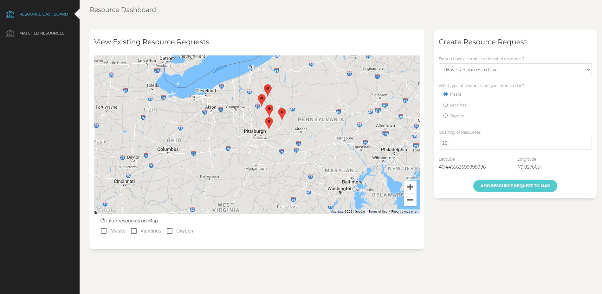
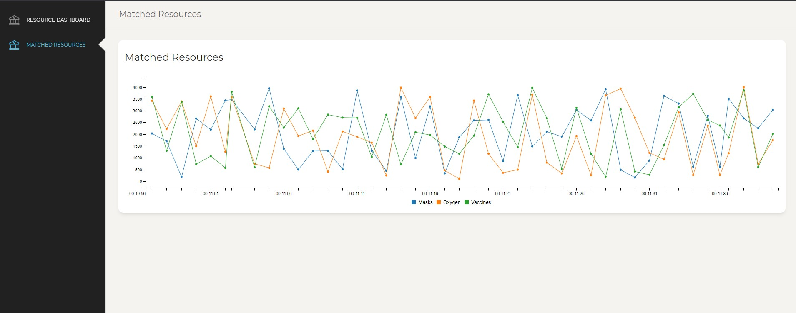

# RedisResourceMap

COVID-19 Resource Dashboard is a project leveraging the power of RediSearch, RedisGears, and Redis PubSub to create a live-updating, crowdsourced dashboard to connect places with excess supply of masks, oxygen, and vaccines to places lacking in such supplies. Users can add locations to indicate both excess supply and required resources, and the RedisGears matching engine will utilize the power of RediSearch geospatial querying to match up supplies with requirements.

## How data is stored

- Resource and location data are stored as documents in the RediSearch format. They contain the fields:
  - masks (Numerical)
  - vaccines (Numerical)
  - oxygen (Numerical)
  - updated (Numerical)
  - coords (Geo)
- Data is queried with the RediSearch API, specifically using `FT.SEARCH` with heavy use of `GEORADIUS`. This is used to query within a certain radius near a location.
- New data is processed with RedisGears async jobs, and sent via Redis PubSub on either the `new_data` channel or `match_data` channel (if a resource is matched)

## Screenshots

## Instructions

- Run the Redis labs docker image: `docker run -p 6379:6379`
- Using pip and python 3.7, install the requirements in `requirements.txt`
- Run `python server.py` from `backend/`
- Run `npm install` and `npm start` from `frontend/`
